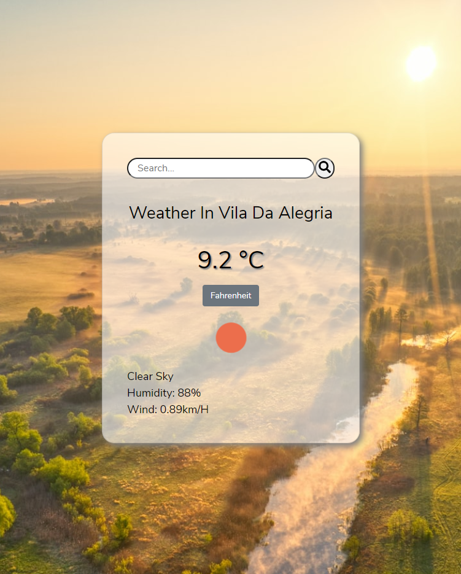

<!--  

# TO DO LIST

> This is a JS application made of different modules using webpack.

Original project specification: [The Odin Project](https://www.theodinproject.com/paths/full-stack-javascript/courses/javascript/lessons/todo-list)


## Built With

- Html, CSS, and JavaScript;
- Git and GitHub.

## Screenshots


---


## Live Demo
[To Do List](https://anapdh.github.io/to-do-list/dist/index.html)

## Prerequisites

- Node.js

## Getting Started

To get a local copy up and run the project, follow these simple example steps:

### Install

You can download the code to your personal computer cloning the repository using the following command:

```
git clone https://github.com/anapdh/to-do-list.git
```

After cloning the repository and opening it in your code editor, run the following code in the terminal:

```
npm install
```

### Run

Run the application by launching your local webserver and index.html file in the browser: http://127.0.0.1:5500/dist/index.html

## Authors

👩🏼‍💻 **Ana Paula Hübner**

- GitHub: [@anapdh](https://github.com/anapdh)
- LinkedIn: [LinkedIn](https://www.linkedin.com/in/anapdh)
- Twitter: [@dev_anahub](https://twitter.com/dev_anahub)

## 🤝 Contributing

Contributions, issues, and feature requests are welcome!

Feel free to check the [issues page](https://github.com/anapdh/to-do-list/issues).

## Show your support

Give a ⭐️ if you like this project!

## 📝 License

This project is [MIT](./LICENSE) licensed.
-->